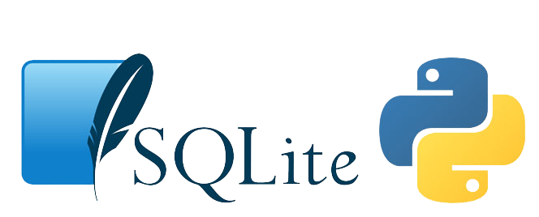

<!--
*** Thanks for checking out the Best-README-Template. If you have a suggestion
*** that would make this better, please fork the repo and create a pull request
*** or simply open an issue with the tag "enhancement".
*** Thanks again! Now go create something AMAZING! :D
-->

<!-- PROJECT SHIELDS -->
<!--
*** I'm using markdown "reference style" links for readability.
*** Reference links are enclosed in brackets [ ] instead of parentheses ( ).
*** See the bottom of this document for the declaration of the reference variables
*** for contributors-url, forks-url, etc. This is an optional, concise syntax you may use.
*** https://www.markdownguide.org/basic-syntax/#reference-style-links
-->
![Contributors][contributors-shield]
![Technologies Used][t-s]

<!-- PROJECT LOGO -->
 

  

  <h3 align="center">AMS with GUI</h3>

  

    <a href="https://github.com/whohet/AMS/"><strong>Explore the docs »</strong></a>
     
     
    <a href="https://github.com/whohet/AMS/">View Demo</a>
    ·
    <a href="https://github.com/whohet/AMS/issues">Report Bug</a>
    ·
    <a href="https://github.com/whohet/AMS/issues">Request Feature</a>
  

<!-- TABLE OF CONTENTS -->

  
Table of Contents

  <ol>
    <li>
      <a href="#about-the-project">About The Project</a>
      <ul>
        <li><a href="#built-with">Built With</a></li>
      </ul>
    </li>
    <li>
      <a href="#getting-started">Getting Started</a>
      <ul>
        <li><a href="#prerequisites">Prerequisites</a></li>
      </ul>
    </li>
    <li><a href="#usage">Usage</a></li>
    <li><a href="#contributing">Contributing</a></li>
    <li><a href="#acknowledgements">Acknowledgements</a></li>
  </ol>

<!-- ABOUT THE PROJECT -->
## About The Project

AMS stands for Attendance Management System. It is built using Python, QT5 and SQLite.
AMS allows to manage attendance of students easily of a particular department.

### Some ScreenShots
![Product Name Screen Shot][product-screenshot1]

![Product Name Screen Shot][product-screenshot2]

![Product Name Screen Shot][product-screenshot3]

![Product Name Screen Shot][product-screenshot4]

![Product Name Screen Shot][product-screenshot5]

### Built With

* [Python](https://www.python.org/)
* [QT5](https://www.qt.io/)
* [SQLite](https://www.sqlite.org/)

<!-- GETTING STARTED -->
## Getting Started

Simply download to use the application.

Now, install the dependencies mentioned in prerequisites section.

Now, simply run the main.py file with the command `python main.py`

### Prerequisites

* Python3
* PyQT5
* SQLite

<!-- USAGE EXAMPLES -->
## Usage
The application is divided into 8 different interfaces.
* Login Page
Appropiate user enters correct Login ID and Password and proceeds into his/her interface..

* Infomation about Database
Basic data, i.e courses offered by Department and Faculty which are associated with the courses are shown here.

* Department's Head Interface
Head of the Department can assign new faculties to appropiate courses, delete faculties, enroll new students and assign them courses and faculties of their choice  and delete students. All these have their own interfaces.
If any faculty who is assigned with students is deleted, then all students under that faculty is shifted to other faculty who is associated with same course automatically.
This user has to assign IDs and Passwords to the other users too.
To keep it simple, the default ID and password of Head is set to "admin", which can be changed from "main.py" file.
By default there are 4 subjects and 4 faculties, one assiociated with each subject, which can be changed from "database.py" file.

* Faculty's Interface
Faculties can login into their portals and take attendance of all students assigned to their class.

* Student's Interface
Students can login into their portals and see their overall attendance in the Subjects they have opted for. They can also see attendace date-wise status.

All these data is stored into database.db file which is created by SQLite in the folder where program is stored.
<!-- CONTRIBUTING -->
## Contributing

Contributions are what make the open source community such an amazing place to be learn, inspire, and create. Any contributions you make are **greatly appreciated**.

1. Fork the Project
2. Create your Feature Branch (`git checkout -b feature/AmazingFeature`)
3. Commit your Changes (`git commit -m 'Add some AmazingFeature'`)
4. Push to the Branch (`git push origin feature/AmazingFeature`)
5. Open a Pull Request

<!-- CONTACT -->
## Contact

Het Patel - [@whohet](https://github.com/whohet) - whohet@gmail.com

Divya Patel - [@dd-712](https://github.com/dd-712) - divya807950@gmail.com

Hrushi Patel - [@Hp-175](https://github.com/Hp-175) - patelhrushi16@gmail.com

Project Link: [https://github.com/whohet/AMS](https://github.com/whohet/AMS)

<!-- ACKNOWLEDGEMENTS -->
## Acknowledgements

[contributors-shield]: https://img.shields.io/github/contributors/whohet/AMS
[contributors-url]: https://github.com/othneildrew/Best-README-Template/graphs/contributors
[t-s]: https://img.shields.io/badge/Python3%2C%20QT5-SQLite-blue
[product-screenshot1]: images/ss1.png
[product-screenshot2]: images/ss2.png
[product-screenshot3]: images/ss3.png
[product-screenshot4]: images/ss4.png
[product-screenshot5]: images/ss5.png

